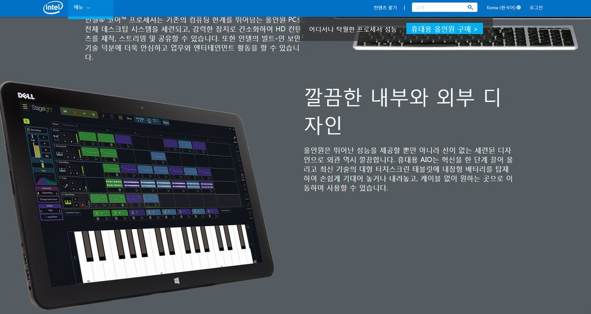

# hangulWordBreak

2바이트 한글문자를 단어가 깨지지 않도록 '띄어쓰기'를 기준으로 해당 p태크 객체 가로 크기에 맞추어서 wordbreak를 만들어줍니다.


<del>디자이너들의 적 단<br>어 강제 개행을 없<br>애자!</del>

## Installation

```shell
$ bower install hangulWordBreak

```

## Usage

본문텍스트에 적용한 css파일에서 명시한 동일한 웹폰트명을 인자로 넘겨준다. 


###example

```javascript
wordBreak('Your Web Font Name', 'Your Target <p> Class Name');
ex) wordBreak('NotoSans', '.pageText'); 

```

 

## Bug Report
<a href="mailto:zhenos@hotmail.com">zhenos@hotmail.com</a>
